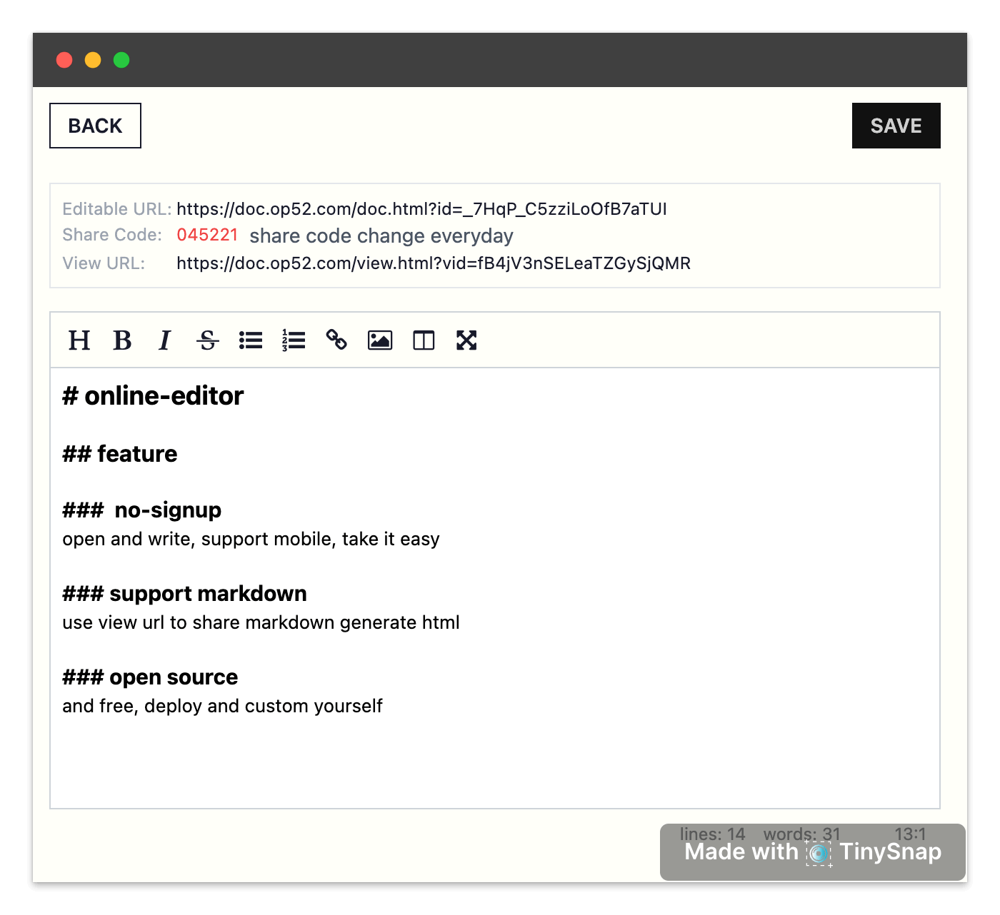

# online editor - edit online doc without sign-up.

https://doc.op52.com

## Features

1. No-signup - no need to register, no account system, just open and write
2. Browser Based - no app download, small load size, write in any environment.
3. [Todo] Auto Backup - backup version keep in sever, don't worry wrong edit.
4. No ADs - no ad, no fee.
5. [Todo] Keep Secret - set and doc level password, no one can see the content without password
6. View Mode - one doc has two url, view url and edit url
7. [Todo]Rich Templates - beatiful document to share, screenshots
 
 

 
## Deploy

1. fork this repo
2. Add Project in Vercel https://vercel.com/dashboard
3. Vercel + MongoDB Integration https://vercel.com/integrations/mongodbatlas


## Develop

```
npm install
npm i vercel -g
vercel dev
```

watch and update tailwindcss

```
npm run style
```
